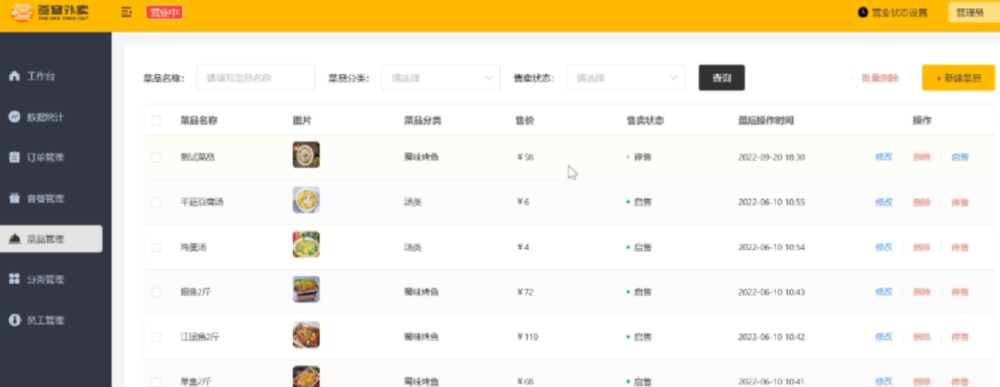
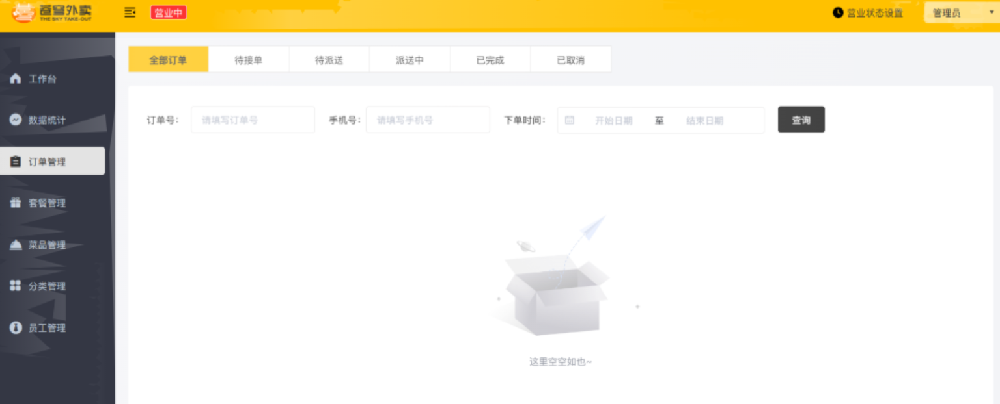
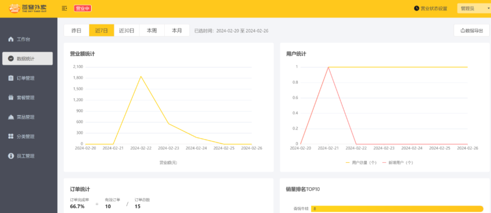
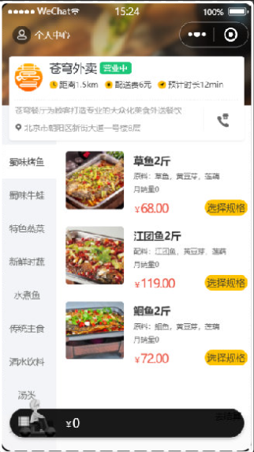
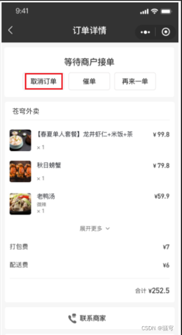

<h1 align="center">Smart Takeout Backend</h1>

<p align="center">
  
  
  
  
  
  
  
</p>

A Spring Boot–based food delivery backend system for restaurant management and online ordering scenarios.  
This project covers both the **admin management side** and the **mobile ordering side**, and focuses on practical backend engineering topics such as authentication, caching, scheduled tasks, real-time notifications, layered architecture, and deployment-oriented configuration.

---

## Table of Contents

- [Project Overview](#project-overview)
- [Core Features](#core-features)
- [Technical Highlights](#technical-highlights)
- [Tech Stack](#tech-stack)
- [System Architecture](#system-architecture)
- [Project Structure](#project-structure)
- [Business Modules](#business-modules)
- [Getting Started](#getting-started)
- [Configuration](#configuration)
- [Run the Project](#run-the-project)
- [API Testing](#api-testing)
- [Screenshots](#screenshots)
- [Development Notes](#development-notes)
- [Future Improvements](#future-improvements)
- [License](#license)

---

## Project Overview

**Smart Takeout Backend** is a backend service for a food delivery platform. It supports restaurant-side management operations such as employee, category, dish, set meal, and order management, while also providing user-oriented online ordering capabilities including dish browsing, cart operations, address management, order submission, and order tracking.

The project is designed around common enterprise backend practices and highlights a complete development workflow from API design to caching, scheduling, real-time communication, and deployment support.

---

## Core Features

### Admin Side
- Employee login and identity verification
- Employee management
- Category management
- Dish management
- Set meal management
- Order management
- Business status switching
- Dashboard/statistical data support

### User Side
- User login
- Browse dishes and set meals
- Shopping cart operations
- Address book management
- Place orders online
- View order history
- Reorder support
- Order status tracking
- Order reminder / related interaction flow

---

## Technical Highlights

### 1. Secure Authentication Workflow
- JWT-based login and identity verification
- Custom interceptor for request authentication
- `ThreadLocal` used to store current user context during request processing
- Token validation integrated into request flow to determine login status efficiently

### 2. High-Performance Caching
- Redis used to cache high-frequency data such as business status and category/dish data
- Spring Cache used to simplify cache operations and reduce boilerplate code
- Helps improve response speed and backend throughput

### 3. Cache Consistency Strategy
- Cache update and expiration strategy applied to reduce data inconsistency
- Ensures better synchronization between database state and cached content

### 4. Real-Time Notification
- WebSocket used to establish long-lived communication between client and server
- Supports incoming-order reminder and customer reminder scenarios

### 5. Scheduled Task Processing
- Spring Task used for time-based order processing
- Supports automatic handling for timeout-related order status changes such as cancellation

### 6. Engineering-Oriented Development
- Maven multi-module project structure
- Layered development with clear separation of concerns
- Git-based version control
- Nginx can be used as an HTTP server and reverse proxy for deployment scenarios

---

## Tech Stack

- **Java 8**
- **Spring Boot**
- **Spring MVC**
- **MyBatis**
- **MySQL**
- **Redis**
- **Spring Cache**
- **JWT**
- **WebSocket**
- **Spring Task**
- **Maven**
- **Lombok**
- **Nginx**

---

## System Architecture

This project follows a typical layered backend architecture:

- **Controller Layer**  
  Handles HTTP requests and API responses

- **Service Layer**  
  Encapsulates business logic and transaction-related operations

- **Mapper Layer**  
  Handles database access through MyBatis

- **Entity / DTO / VO Layer**  
  Separates persistence objects, request transfer objects, and response view objects

- **Common Module**  
  Stores shared utilities, constants, exception classes, and unified response wrappers

---

## Project Structure

```bash
smart-takeout-backend/
├── sky-common/                     # Common utilities, constants, exception handling, result wrapper
├── sky-pojo/                       # Entity, DTO, VO classes
├── sky-server/                     # Main Spring Boot application
├── pom.xml                         # Parent Maven configuration
└── README.md
```

---

## Business Modules

### Employee Module
Supports employee login, identity verification, and backend access.

### Category Module
Manages dish and set meal categories.

### Dish Module
Supports dish CRUD, flavor configuration, and status control.

### Set Meal Module
Manages combo meal creation, update, and availability state.

### Shopping Cart Module
Supports add, remove, update quantity, and clear-cart operations.

### Address Book Module
Provides user address management for delivery scenarios.

### Order Module
Implements order placement, order query, status updates, history records, and reminder-related business flow.

### Statistics Module
Provides basic operational statistics for the management side.

---

## Getting Started

### Prerequisites

Please make sure the following tools are installed:

- JDK 8
- Maven 3.8+
- MySQL 8.x
- Redis
- IntelliJ IDEA (recommended)

---

## Configuration

Before running the project, configure your local environment.

### 1. Database Configuration

Edit:

```yaml
sky-server/src/main/resources/application-dev.yml
```

Example:

```yaml
spring:
  datasource:
    driver-class-name: com.mysql.cj.jdbc.Driver
    url: jdbc:mysql://localhost:3306/sky_take_out?serverTimezone=Asia/Shanghai&useUnicode=true&characterEncoding=utf-8&useSSL=false
    username: your_username
    password: your_password
```

### 2. Redis Configuration

```yaml
spring:
  data:
    redis:
      host: localhost
      port: 6379
      database: 0
```

### 3. Security Configuration

Do **not** commit real secrets such as:
- database passwords
- cloud credentials
- API keys
- production tokens

Recommended approach:
- use environment variables
- keep local config files out of version control
- use sanitized public configuration files

---

## Run the Project

### 1. Clone the Repository

```bash
git clone https://github.com/itnann/food-delivery-backend.git
cd food-delivery-backend
```

### 2. Build the Project

```bash
mvn clean install
```

### 3. Start the Application

```bash
mvn spring-boot:run
```

Default local address:

```bash
http://localhost:8080
```

---

## API Testing

You can test the backend with:
- Postman
- Apifox
- Swagger / Knife4j (if enabled)

Typical test scenarios:
- employee login
- category CRUD
- dish CRUD
- set meal CRUD
- shopping cart operations
- address book operations
- order placement and order history query

---

## Screenshots

### admin





### customer




---

## Development Notes

This project helped me practice and strengthen my understanding of:

- enterprise-style Java backend development
- layered architecture and modular project design
- JWT authentication and request interception
- `ThreadLocal` usage in request-scoped user context
- Redis caching and Spring Cache integration
- cache consistency handling
- WebSocket-based real-time communication
- scheduled task processing with Spring Task
- API testing with Apifox / Swagger-related tools
- reverse proxy and deployment concepts with Nginx

---

## Future Improvements

- Dockerized deployment
- CI/CD workflow
- role-based permission refinement
- payment module integration
- message queue for order-event decoupling
- unit testing and integration testing
- monitoring and logging enhancements
- cloud deployment support

---

## License

This project is intended for learning, technical practice, and portfolio presentation.
